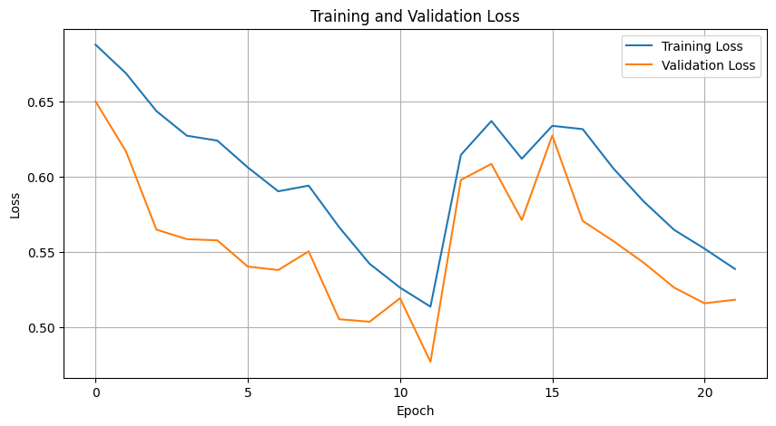
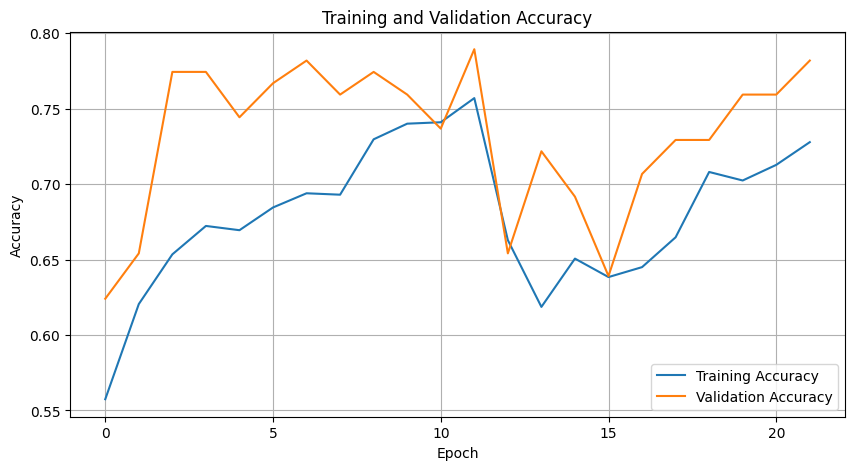
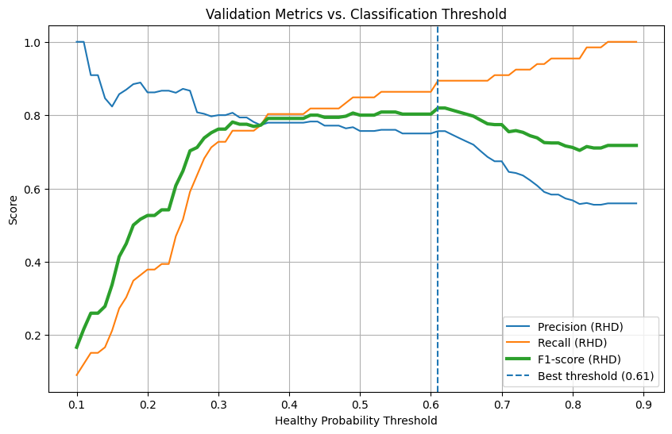
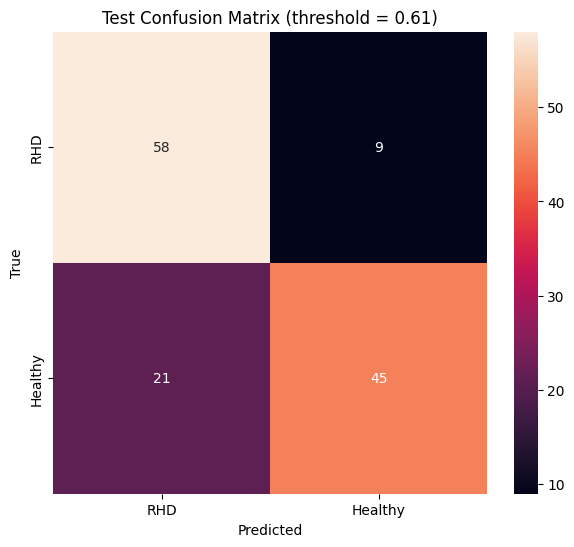

# RHD Classification from PCG Signals using BiLSTM

A research/proof-of-concept implementation for classifying phonocardiogram (PCG) recordings into Rheumatic Heart Disease (RHD) and Healthy classes using MFCC features and a Bidirectional LSTM (BiLSTM).

## Purpose

This project was developed to support an academic paper and demonstrate that an RNN-based approach can be applied to PCG recordings for RHD classification. It is **not a clinical diagnostic system**.

## Pipeline

```text
PCG WAV recordings
        ↓
MFCC feature extraction (20 coefficients)
        ↓
Pad / truncate to 400 time steps
        ↓
80% train / 10% validation / 10% test
        ↓
2-layer Bidirectional LSTM
        ↓
Validation-based threshold selection
        ↓
Final test evaluation
```

## Model

- Input: MFCC sequences
- MFCC features: 20
- Maximum time steps: 400
- Bidirectional LSTM: 64 units, return sequences
- Bidirectional LSTM: 64 units
- Dropout: 0.3
- Dense layer: 64 units, ReLU
- Output: 1 sigmoid unit
- Optimizer: Adam
- Loss: Binary cross-entropy
- Early stopping + learning-rate reduction

The sigmoid output represents the probability of the **Healthy (label 1)** class.

## Dataset

The PCG dataset is not included in this repository. Put the permitted dataset in one of these locations:

### Google Colab

```text
My Drive/training_rhd/
├── REFERENCE.csv
├── a0001.wav
├── a0002.wav
└── ...
```

The notebook automatically detects Colab and mounts Google Drive.

### Local

```text
data/training_rhd/
├── REFERENCE.csv
├── a0001.wav
├── a0002.wav
└── ...
```

`REFERENCE.csv` must contain at least:

- `filename`
- `label`

Original labels are expected to be `-1 = RHD` and `1 = Healthy`; the notebook converts these to `0 = RHD` and `1 = Healthy`.

## Running in Google Colab

1. Open `RHD_PCG_BiLSTM_Classification.ipynb` in Google Colab.
2. Place `training_rhd` directly inside `My Drive`.
3. Run the notebook from the first cell.
4. If Colab reports `No module named 'resampy'`, run the optional installation cell and restart the runtime before rerunning the notebook.

## Results from the current experiment

| Metric | Result |
|---|---:|
| Test accuracy | **76.69%** |
| RHD precision | **0.73** |
| RHD recall | **0.87** |
| RHD F1-score | **0.79** |
| Healthy precision | **0.83** |
| Healthy recall | **0.68** |
| Selected Healthy-probability threshold | **0.61** |

Test confusion matrix:

```text
                 Predicted
                 RHD   Healthy

True RHD          58      9
True Healthy      21     45
```

## Repository structure

```text
RHD-PCG-BiLSTM/
│
├── RHD_PCG_BiLSTM_Classification.ipynb
├── README.md
├── requirements.txt
├── .gitignore
├── training_validation_loss.png
├── training_validation_accuracy.png
├── threshold_analysis.png
└── confusion_matrix.png

```

## Results

### Training Performance





### Classification Threshold



### Test Confusion Matrix



## Disclaimer

This project is an academic research/proof-of-concept implementation. The reported performance should not be interpreted as clinical diagnostic accuracy. Clinical deployment would require independent external validation and appropriate medical/clinical evaluation.

